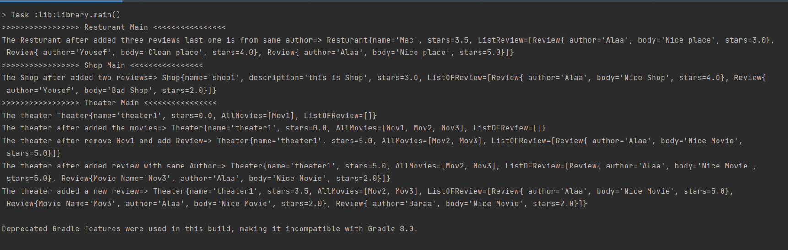

## Inheritance and Interfaces

## Library inheritance  
we can give Review for multiple Facilities as Resturant,Shop and Theater.  
  
> **Review** class  
>> It contain two constructor with different parameter.  
>> the first one set the body,author and check the stars.  
>> the second one is set the body,author,MovieName and check the stars.  
>> It has **CheckStars** Method : which check if the star is between 0 and 5.  
>> **toString** Method  
  

> I create SuperClass **Facility**  
>> It has **name,star and price** variables so can declare the constuctor of Resturant,Shop or Theater and set this values. And **avgStars,sumReviewStars and douplicateAuthour** which I use it for update the stars after the Review Added and **ListOFReview** so we can Add the review for each facility.  
>> It has **addReview** Method: It check if this the first time the author add a review then add the review to the list and update the stars,otherwise just add the review and don't update the stars and add one to the douplicateAuthour so not use this review to calculate the stars average.  
>> It has **updateStars** Method : which update the stars.  
>> And it implements an Interface **ReviewInterface** which has **addReview** Method.  
>> **toString** Method  
  

> **Resturant** class  
>> Extends the superclass Facility  
>> has a constructor set the super(name and price)  
>> **toString** Method  
  

> **Shop** class  
>> Extends the superclass Facility  
>> has a constructor set the super(name and price)  
>> **toString** Method  

> **Theater** class  
>> Extends the superclass Facility  
>> It has a **AllMovies** String ArrayList.  
>> has a constructor set the name and the List of Movies.  
>> **addMovie** Method : check if the AllMovies is null so AllMovies.add(movie), Else go through the Array if the movie already in the list then don't add it, otherwise add the movie to the list.  
>> **RemoveMovie** Method : check if the AllMovies is null then there is no movie to remove, Else go through the Array and when find the movie remove it AllMovies.remove(the index of the movie), otherwise there is no movie in this list to remove it.  
>> I override the **addReview** Method : so it is also check if the movie you want to review it is in the AllMovies list.  
  

  
### App  
  

