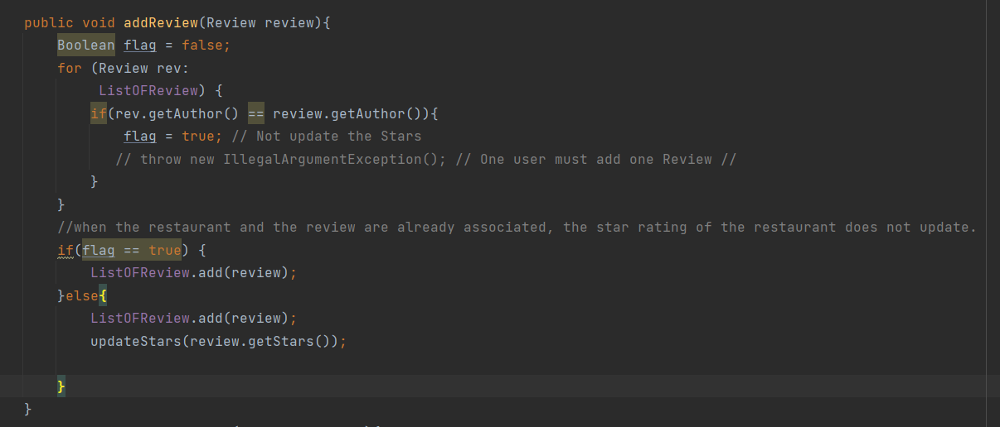
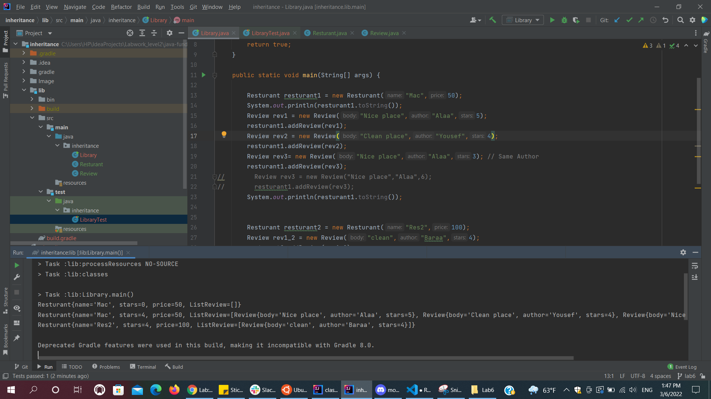

## Inheritance and Interfaces

## Composition and Inheritance, Part 1

I create two classes to represent reviews of restaurants.  
* Class Resturant : Resturant Contructer take name and price as parameter.  
And It has ArrayList of Review Class to store the reviews for this Resturant. 
To Add Review there is a Method AddReview.  It check if the user already added a review will not update the stars rating for that resturant. Else if this first time add the review then will add the review and update the star rate average.  
  
  
* Class Review : Review Constructor take Body, Author and stars as parameter.  
And check the stars must be between the 0 and 5. Else will ttrough an exception.  
  
  
### App  
  

